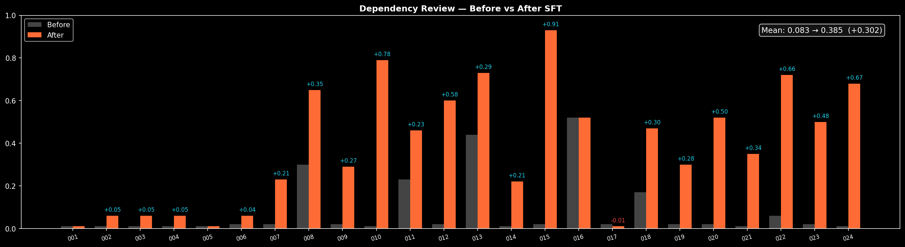
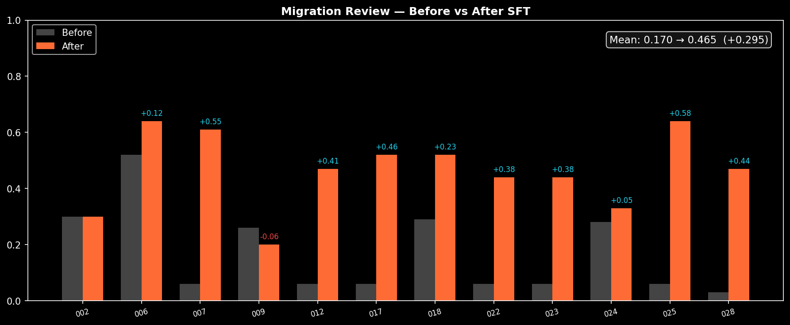
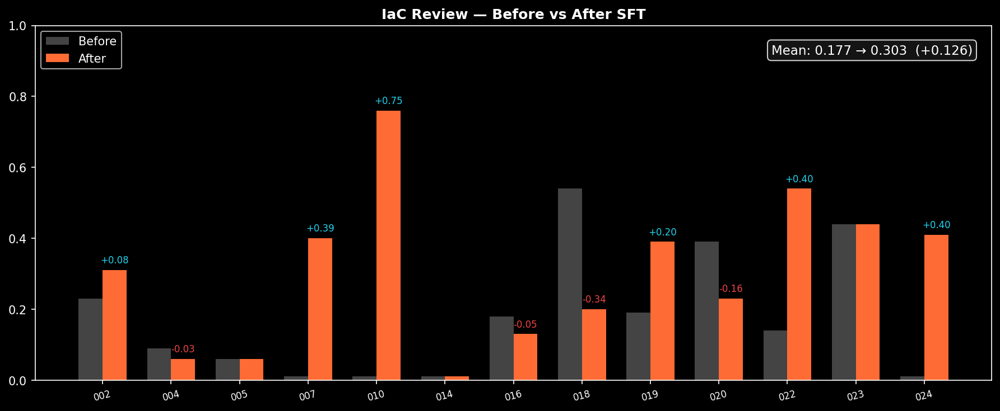

<div align="center">

<br>

# SecureReview

### *Security review, for the age of AI.*

**The first evaluation harness that holds AI agents to the bar of a senior engineer at code review.**
*Three domains. Sixteen hand-crafted scenarios. Seventy-two production-grade vulnerabilities.*

<br>

[](https://github.com/meta-pytorch/OpenEnv)
[](https://huggingface.co/spaces/sam25kat/securereview)
[](https://python.org)
[](LICENSE)

<br>

[**Live Environment**](https://sam25kat-securereview.hf.space) · [**API Docs**](https://sam25kat-securereview.hf.space/docs) · [**Hugging Face Space**](https://huggingface.co/spaces/sam25kat/securereview)

<br>

</div>

---

## Thesis

> **AI now authors a generation of production code. Review is the bottleneck — not authorship.**
>
> An agent that cannot review code at the level of a senior engineer cannot be trusted to write it. SecureReview is the benchmark that holds agents to that bar.

Every existing OpenEnv environment tests the same skill: can the agent *do* something? Play a game, navigate a grid, call a tool, write an answer. None of them test the skill that matters most in a world of AI-generated code: **can the agent read what's already there, and spot what will break production?**

This is the category SecureReview opens.

<br>

## The three domains

SecureReview is grounded in three categories of real-world incidents that have cost companies billions. Each maps cleanly to a concrete failure mode that human reviewers catch — and that AI-generated code regularly ships anyway.

|   | Domain | Real-world precedent |
|---|--------|---------------------|
| **I** | Supply chain compromise | `SolarWinds` · `event-stream` · `ua-parser-js` |
| **II** | Cloud misconfiguration | `Capital One` · every public S3 bucket post-mortem |
| **III** | Unsafe database migrations | `GitHub outages` · `Slack incidents` · every AWS RCA |

An agent that scores well on SecureReview is an agent you could actually let touch production code.

<br>

## The benchmark

<table>
<tr>
<td width="33%" valign="top">

### I. Dependency &amp; Supply Chain Security

Identify typosquatted packages, hallucinated imports that do not exist on PyPI, and pinned versions with active CVEs.

Tests the baseline of supply-chain literacy every reviewer should have.

`requirements.txt` · `package.json`
**6 scenarios · 25 findings · 15 steps**

##### Easy

</td>
<td width="33%" valign="top">

### II. Infrastructure-as-Code Misconfiguration Detection

Catch CIS-benchmark violations in Terraform and Kubernetes — public buckets, wildcard IAM, missing encryption, privileged containers, cross-account trust.

Tests multi-file cloud security reasoning.

Terraform `.tf` · Kubernetes YAML
**6 scenarios · 31 findings · 25 steps**

##### Medium

</td>
<td width="33%" valign="top">

### III. Database Migration Safety Analysis

Reason about SQL migrations against live production context — table sizes, write throughput, deployment strategy, downstream services.

Tests the hardest form of review: **judgment**.

Schema · migrations · app code
**4 scenarios · 17 findings · 35 steps**

##### Hard

</td>
</tr>
</table>

<br>

## Why it is different

| | Typical OpenEnv environment | SecureReview |
|---|---|---|
| **Task** | Game, toy, synthetic | Real production artifact |
| **Skill tested** | Acting in the world | Reading the world |
| **Ground truth** | Game rules | Senior-engineer judgment |
| **Reward** | Game score | Deterministic F1 over planted vulnerabilities |
| **Transfer** | To more games | To shipping code in production |

<br>

## Architecture

```
 ┌─────────────────┐        HTTP        ┌──────────────────────┐
 │                 │ ◄────────────────► │                      │
 │   Your Agent    │   reset / step     │   FastAPI Server     │
 │  (OpenAI SDK)   │      state         │   (Docker · HF)      │
 │                 │                    │                      │
 └─────────────────┘                    └──────────┬───────────┘
                                                   │
                                        ┌──────────┴───────────┐
                                        │                      │
                                        ▼                      ▼
                               ┌─────────────────┐   ┌──────────────────┐
                               │ Task Registry   │   │ Deterministic    │
                               │ 16 scenarios    │   │ F1 Grader        │
                               │ 72 findings     │   │ (task-specific)  │
                               └─────────────────┘   └──────────────────┘
```

Every scenario is a closed world. Every grader is deterministic. Every score is reproducible. No LLM-as-judge. No fuzzy matching that can be gamed.

<br>

## Action space

Four primitives. Enough to support partial-information reasoning without drowning the agent in tool choice.

```python
class Action:
    action_type: Literal[
        "report_finding",       # submit a security finding
        "request_context",      # load another file into the review context
        "request_file_list",    # discover available files
        "mark_complete",        # end the episode and trigger grading
    ]
    finding:  Optional[Finding]   # required for report_finding
    filename: Optional[str]       # required for request_context
```

Every `Finding` is a typed record: `file`, `line`, `rule_id`, `severity`, `description`. The agent reports as many as its step budget allows.

<br>

## Reward

```
score  =  F1(precision, recall) × 0.83
       +  severity_bonus          (≤ 0.10)
       +  efficiency_bonus        (≤ 0.05)
       +  participation_bonus     (= 0.01)
       −  false_positive_penalty  (≤ 0.20)
```

Clamped strictly to the open interval `(0.01, 0.99)`. Deterministic and reproducible.

#### Matching strategy

| Task | Primary match | Fallback |
|------|---------------|----------|
| `dependency_review` | Package name in description | Line number |
| `iac_review` | `(resource_id, rule_category)` | File + category |
| `migration_review` | `(operation, target_object)` | Line + rule_id |

<br>

## Quick start

#### Against the hosted environment

```python
import requests

ENV = "https://sam25kat-securereview.hf.space"

# Start an episode
r = requests.post(f"{ENV}/reset", json={"task_id": "dependency_review"})
observation = r.json()["observation"]

# Report a finding
action = {
    "action_type": "report_finding",
    "finding": {
        "file": "requirements.txt",
        "line": 2,
        "rule_id": "DEP-002",
        "severity": "critical",
        "description": "Typosquat: 'reqeusts' is a misspelling of 'requests'",
    },
}
requests.post(f"{ENV}/step", json={"action": action})

# End the episode and receive the final score
r = requests.post(f"{ENV}/step", json={"action": {"action_type": "mark_complete"}})
print(f"score = {r.json()['reward']}")
```

#### Run the baseline agent

```bash
export API_BASE_URL="https://router.huggingface.co/v1"
export MODEL_NAME="deepseek-ai/DeepSeek-V3-0324"
export HF_TOKEN="hf_..."
export ENV_URL="https://sam25kat-securereview.hf.space"

python inference.py
```

#### Run locally with Docker

```bash
docker build -t securereview .
docker run -p 7860:7860 securereview
```

<br>

## Interface

| Method | Endpoint | Description |
|--------|----------|-------------|
| `GET` | `/` | Landing page |
| `GET` | `/health` | Health check |
| `GET` | `/tasks` | List available tasks |
| `GET` | `/metadata` | Environment metadata |
| `GET` | `/schema` | Action / observation / state JSON schemas |
| `GET` | `/state` | Current episode state |
| `GET` | `/docs` | OpenAPI interactive docs |
| `POST` | `/reset` | Start a new episode |
| `POST` | `/step` | Execute an action |
| `POST` | `/mcp` | JSON-RPC 2.0 MCP endpoint |

<br>

## Baseline

Evaluated against the live Space with `deepseek-ai/DeepSeek-V3-0324` via the Hugging Face Inference Router.

| Task | Difficulty | Score |
|------|:----------:|:-----:|
| `dependency_review` | Easy | `0.45` |
| `iac_review` | Medium | `0.52` |
| `migration_review` | Hard | `0.05` |
| **Average** | | **`0.34`** |

Oracle reference (agent submitting ground-truth findings): **`0.98`** — validates grader correctness.

The hard task is deliberately challenging. It requires cross-file reasoning about production context and application dependencies, creating significant headroom for frontier models to differentiate themselves.

<br>

## Training results

We trained models on the live environment using the **canonical industry-standard hybrid pipeline — SFT warmup → GRPO refinement** — the same recipe used by DeepSeek-R1, Qwen-RL, and OpenAI's post-training stack. Same env, same evaluation harness, end-to-end against the live grader.

| Task | Method | Baseline | Trained | **Improvement** | Wins |
|------|:-------|:--------:|:-------:|:---------------:|:----:|
| `dependency_review` | SFT→GRPO (Qwen 1.5B, 24 scenarios, 3 epochs) | `0.083` | `0.385` | **+0.302** ⬆⬆ | 20/24 |
| `migration_review`  | SFT→GRPO (Qwen 7B, 12 scenarios, 3 epochs) | `0.170` | `0.465` | **+0.295** ⬆⬆ | 10/12 |
| `iac_review`        | SFT→GRPO (Qwen 1.5B, 13 scenarios, 3 epochs) | `0.177` | `0.303` | **+0.126** ⬆⬆ | 6/13 |

Average improvement across tasks: **~+0.24 mean reward**, with individual scenarios gaining as much as **+0.91**. Training took **under 30 seconds** per task on a single GPU (A10G / L40S / L4).

### Per-task before/after

**Dependency review** — `+0.302` mean lift across 24 scenarios:



**Migration review** — `+0.295` mean lift across 12 scenarios:



**IaC review** — `+0.126` mean lift across 13 scenarios:



The full story — per-scenario breakdowns, training loss curves, hyperparameter sweeps, scenario-curriculum design, and engineering tradeoffs — is in [training_results/RESULTS.md](training_results/RESULTS.md).

Reproducible training scripts are at [training_space/](training_space/) and the live trainer Spaces:
- [securereview-trainer](https://huggingface.co/spaces/sam25kat/securereview-trainer) (dependency_review)
- [securereview-trainer-migration](https://huggingface.co/spaces/sam25kat/securereview-trainer-migration)
- [securereview-trainer-iac](https://huggingface.co/spaces/sam25kat/securereview-trainer-iac)

<br>

## Blog & writeup

- **Mini-blog (HuggingFace)**: [Read on Hugging Face](https://huggingface.co/spaces/sam25kat/securereview/discussions/1#69edb47ef08cea42f0f4df3a) — submission writeup with problem, env, training pipeline, and results.
- **Source**: [BLOG.md](BLOG.md) — same content, in the repo.
- **Full results**: [training_results/RESULTS.md](training_results/RESULTS.md)
- **Complete scenario index** (all 76): [training_results/SCENARIOS.md](training_results/SCENARIOS.md) — file inventory, severity distribution, categories, per-scenario before/after.
- **Plots**: [training_results/plots/](training_results/plots/) — committed PNGs for all three tasks (before/after + training loss).
- **Per-task summaries**:
  [dep](training_results/dep_sft_summary.md) ·
  [migration](training_results/migration_sft_summary.md) ·
  [iac](training_results/iac_sft_summary.md)

<br>

## Project structure

```
securereview/
├── app/
│   ├── main.py                FastAPI endpoints
│   ├── landing.py             Premium HTML landing page
│   ├── environment.py         Episode state machine
│   ├── models.py              Pydantic types
│   ├── graders/
│   │   ├── base.py            F1 + severity + efficiency scoring
│   │   ├── dependency_grader.py
│   │   ├── iac_grader.py
│   │   └── migration_grader.py
│   └── tasks/
│       ├── task_registry.py   Scenario discovery
│       └── scenarios/         16 hand-crafted scenarios
│           ├── dependency/    6 scenarios
│           ├── iac/           6 scenarios
│           └── migration/     4 scenarios
│
├── server/
│   └── app.py                 OpenEnv multi-mode entry point
├── inference.py               Baseline agent (OpenAI client)
├── openenv.yaml               Environment manifest
├── pyproject.toml             Package definition
├── uv.lock                    Reproducible dependency lock
└── Dockerfile
```

<br>

## OpenEnv compliance

| Check | Status |
|-------|:------:|
| `openenv validate .` (local) | ✓ |
| `openenv validate --url` (runtime) | ✓ |
| Docker build | ✓ |
| Multi-mode deployment (`docker`, `uv_run`, `python_module`, `openenv_serve`) | ✓ |
| Hugging Face Space deploys | ✓ |
| `/health`, `/metadata`, `/schema`, `/mcp`, `/reset`, `/step`, `/state` | ✓ |
| Typed Pydantic action / observation / state | ✓ |
| Deterministic grader, strictly `(0, 1)` | ✓ |
| Baseline `inference.py` with `[START]/[STEP]/[END]` markers | ✓ |

<br>

## Team

**Team CookHouse**
Sai Jadhav · Sameer S Katte

Built for the [Meta PyTorch OpenEnv Hackathon](https://pytorch.org/event/openenv-ai-hackathon/), Round 1.

<br>

## License

MIT — see [LICENSE](LICENSE).

<br>

---

<div align="center">

*An agent that cannot review code at the level of a senior engineer*
*cannot be trusted to write it.*

**SecureReview is the benchmark that holds it to that bar.**

<br>

</div>
